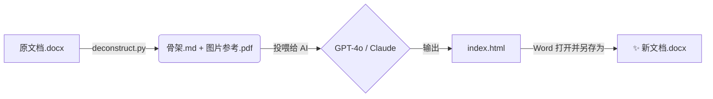

# DocuRebuild 🏗️

基于“解耦与重构”的 AI 文档重建流水线。将 Word 拆解为文本骨架与图片资源，交由 AI 生成带有内联 CSS 的 HTML，最后利用 Word 的网页解析能力另存为排版完美的 `.docx`。

## ⚡ 工作流


```mermaid
graph LR
    A[原文档.docx] -->|deconstruct.py| B(骨架.md + 图片参考.pdf)
    B -->|投喂给 AI| C{GPT-4o / Claude}
    C -->|输出| D[index.html]
    D -->|Word 打开并另存为| E[✨ 新文档.docx]
```
🚀 快速开始
1. 拆骨 (Deconstruct)
运行 Python 脚本，提取源文档素材：
```bash
python deconstruct.py
```
核心产出物（位于 pipeline_output/）：
 * media_source/: 无损高清原图。
 * skeleton.md: 带图片锚点的纯文本骨架。
 * VisualRef.pdf: 供 AI 理解画面的图片参考书。
2. 重构 (Reconstruct)
 * 将 skeleton.md 和 VisualRef.pdf 投喂给 AI。
 * 发送 master_prompt.md 中的指令。
 * 获取 AI 吐出的 HTML 代码并保存为 index.html（与 media_source 同级）。
3. 缝合 (Render)
用 Word 直接打开 index.html，选择 另存为 -> Word 文档 (.docx)，完成高精度图文混排的降维重建。
📂 项目结构
```
DocuRebuild/
├── deconstruct.py      # 提取脚本
│── master_prompt.md    # AI 重建指令
└── pipeline_output/    # 拆解产物 (骨架、图片、参考PDF)
```