# DocuRebuild (AI 文档重建师) 🏗️

> **拒绝修修补补，直接涅槃重生。**
> 基于“解耦与重构”范式的 AI 文档自动化重建流水线。

 

## 💡 核心理念

传统的 AI 文档助手试图直接修改 `.docx` 二进制文件，这往往导致格式崩坏。
**DocuRebuild** 提出了一种新的范式：**不修改，只重建。**

我们将文档处理拆解为两个平行流程：
1.  **基建流 (Python)**：负责“搬砖”。无损提取图片、计算物理尺寸、生成带有锚点的文本骨架。
2.  **认知流 (LLM)**：负责“设计”。理解文档逻辑、看懂图片内容，编写代码来重新生成文档。

## ⚡ 工作流 (The Workflow)

```mermaid
graph LR
    A[烂文档.docx] -->|脚本拆解| B(文本骨架.md)
    A -->|脚本拆解| C(视觉参考.pdf)
    B & C -->|投喂给| D{ChatGPT / Claude}
    D -->|生成代码| E[rebuild.py]
    E -->|本地运行| F[✨ 完美新文档.docx]

```



## 🚀 快速开始

### 第一步：拆骨 (Deconstruct)

运行脚本，将复杂的 Word 文档拆解为 AI 易读的素材。

```bash
# 1. 修改 deconstruct.py 中的 input_file 路径
# 2. 运行脚本
python deconstruct.py

```

**产出物 (`pipeline_output/` 文件夹内):**

* `media_source/`: 存放所有高清原图。
* `skeleton.md`: 带有 `<<IMG_xxx>>` 锚点的纯文本骨架。
* `VisualRef.pdf`: 供 AI 阅读的图片参考手册。

### 第二步：重构 (Reconstruct via Chat)

打开 ChatGPT (GPT-4o) 或 Claude (3.5 Sonnet)：

1. 上传 `skeleton.md` 和 `VisualRef.pdf`。
2. 发送 **[master_prompt.md](./master_prompt.md)**。
3. AI 会根据你的指令（如“换个更专业的字体”、“图片全部居中”），输出一段 Python 代码。

### 第三步：缝合 (Stitch)

将 AI 生成的代码保存为 `rebuild.py`，在本地运行。

```bash
python rebuild.py

```

程序将自动读取本地的高清原图，生成排版完美的最终文档。

## 📂 项目结构

```text
DocuRebuild/
├── deconstruct.py      # [核心] 拆解脚本：提取骨架与视觉参考
│── master_prompt.md # [核心] AI 提示词指令
├── pipeline_output/    # [自动生成] 存放拆解后的中间产物
│   ├── skeleton.md     # 文本骨架 (Markdown)
│   ├── media_source/   # 图片资源库
│   └── VisualRef.pdf   # 视觉参考书
└── requirements.txt    # 依赖库 (python-docx, pillow)

```

## 📄 License

MIT License

